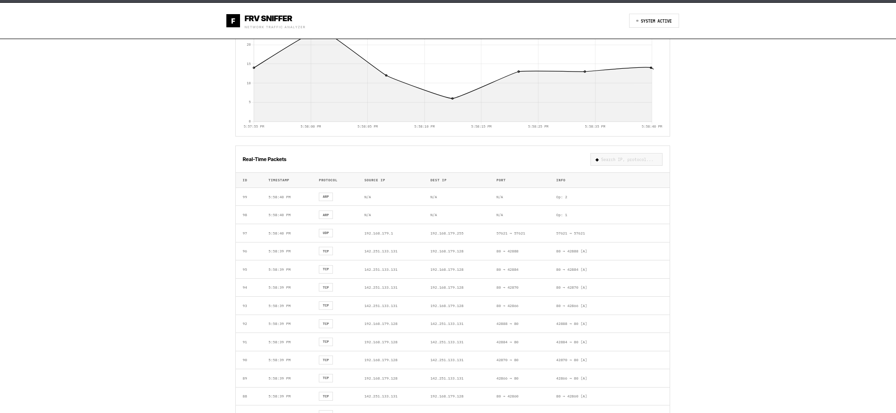
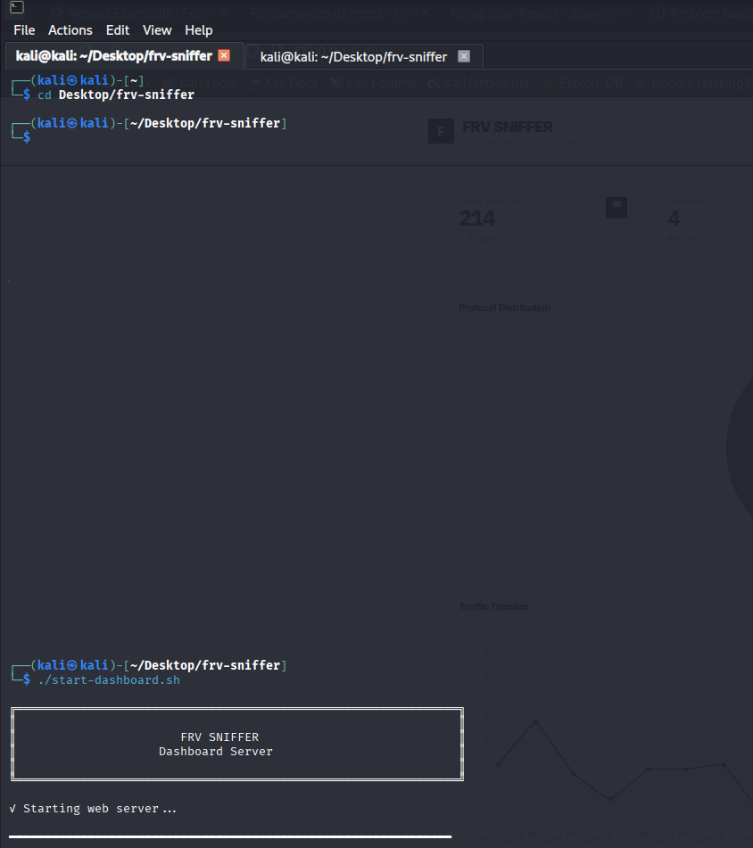

# FRV SNIFFER


---
Analizador de trafico de red con función Alerta


### Requerimientos

- Python 3.8+
- scapy
- flask
- flask-cors

### Instalación

```bash
pip install -r requirements.txt --break-system-packages
```

## Arranque



**Terminal 1 - Dashboard:**
```bash
./start-dashboard.sh
```

**Terminal 2 - Sniffer:**
```bash
sudo python3 backend/sniffer.py
```

### Access Dashboard

Url en el navegador: **http://localhost:8000**


### Captura de paquetes

```bash
sudo python3 backend/sniffer.py -i eth0
```

### Captura Limitada

```bash
sudo python3 backend/sniffer.py -c 1000
```

### Apply BPF Filter

```bash
# HTTP/HTTPS 
sudo python3 backend/sniffer.py -f "port 80 or port 443"

# IP
sudo python3 backend/sniffer.py -f "host 192.168.1.100"

# TCP 
sudo python3 backend/sniffer.py -f "tcp"
```


**FRV SNIFFER** - Network Traffic Analysis System
