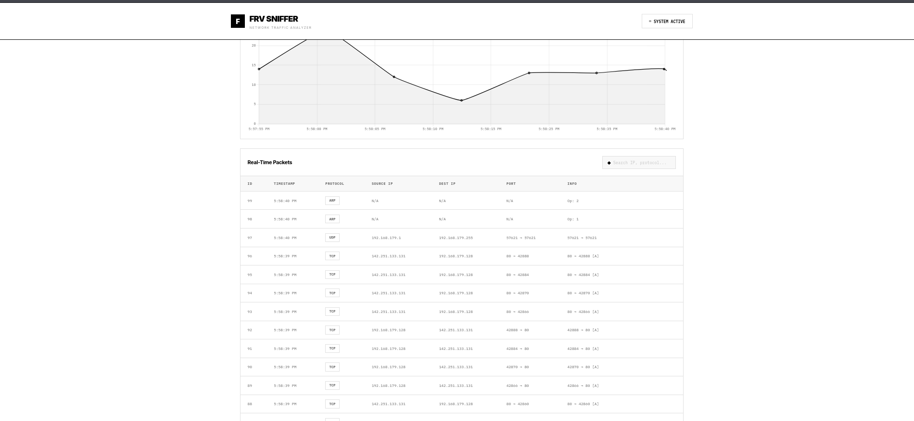

# 🛡️ FRV SNIFFER



---

## Analizador de Tráfico de Red con Detección de Anomalías en Tiempo Real
### *Desarrollado por EstebanCRO*

**FRV Sniffer** es una solución robusta y ligera de captura de paquetes y detección automática de amenazas en redes locales. Permite a administradores de sistemas y estudiantes de ciberseguridad visualizar gráficamente el tráfico de red e identificar anomalías de seguridad en tiempo real a través de un panel web interactivo de alto rendimiento.

---

## Arquitectura del Sistema

El sistema implementa una arquitectura desacoplada en tres niveles:

```
┌─────────────────────────────────────────────────────────────────┐
│                        FRV SNIFFER                              │
├─────────────────────────────────────────────────────────────────┤
│                                                                 │
│  ┌──────────────┐    ┌──────────────┐    ┌──────────────────┐   │
│  │              │    │              │    │                  │   │
│  │   SNIFFER    │───▶│  DATA STORE  │◀───│   API SERVER    │   │
│  │  (Scapy)     │    │  (.jsonl)    │    │   (Flask)        │   │
│  │              │    │              │    │                  │   │
│  └──────────────┘    └──────────────┘    └────────┬─────────┘   │
│        │                                          │             │
│        │ Captura paquetes                         │ REST API    │
│        │ Analiza anomalías                        │             │
│        │ Genera alertas                           ▼             │
│        │                                 ┌──────────────────┐   │
│        │                                 │                  │   │
│        │                                 │   DASHBOARD      │   │
│        └────────────────────────────────▶│   (HTML/JS)      │  │
│                                          │   Chart.js       │   │
│                                          └──────────────────┘   │
│                                                                 │
└─────────────────────────────────────────────────────────────────┘
```

1. **Captura y Análisis (`backend/sniffer.py`)**: Utiliza `scapy` en modo promiscuo. Analiza protocolos clave (ARP, IP, TCP, UDP, DNS, HTTP), rastrea anchos de banda e identifica vectores de ataque comunes en tiempo real. Escribe los flujos en formato JSON Lines.
2. **API REST (`backend/api_server.py`)**: Un microservicio en `Flask` que sirve datos en caché, ofrece streaming en vivo mediante SSE (Server-Sent Events) y expone endpoints estadísticos optimizados.
3. **Dashboard Premium (`frontend/index.html`)**: Interfaz web fluida en modo oscuro con acentos de color por protocolo, gráficas en vivo con `Chart.js`, barra de salud del sniffer, mapas de conexiones IP a IP y lista de alertas de seguridad reactiva.

---

## Requisitos del Sistema

- **Python 3.8+**
- Permisos de administrador/root en el equipo local (requerido para capturar tramas de interfaces físicas).
- Dependencias listadas en [requirements.txt](file:///c:/Users/USUARIO/Desktop/FRV-Sniffer/requirements.txt).

---

## Instalación

Instala las dependencias necesarias ejecutando:

```bash
pip install -r requirements.txt
```

*Nota para sistemas Linux modernos:* Si encuentras un bloqueo del gestor de paquetes de tu distribución, puedes usar `--break-system-packages` o instalar en un entorno virtual (`venv`):

```bash
python3 -m venv venv
source venv/bin/activate
pip install -r requirements.txt
```

---

## Puesta en Marcha

### Arranque Completo (Sniffer + Dashboard)
Puedes arrancar ambos servicios de forma paralela usando el script de arranque principal:

```bash
sudo ./start.sh
```

### Arranque Modular (Por separado)

**1. Levantar el Servidor Web (Dashboard):**
```bash
./start-dashboard.sh
```
*Acceso directo en el navegador:* **[http://localhost:8000](http://localhost:8000)**

**2. Levantar el Capturador (Sniffer - Requiere Privilegios):**
```bash
# Modo Interactivo: Te permite listar y elegir la interfaz de red al iniciar (como Wireshark)
sudo python3 backend/sniffer.py

# Modo Directo: Iniciando en una interfaz específica
sudo python3 backend/sniffer.py -i eth0
```

## Parámetros y Opciones Avanzadas

El motor del sniffer admite múltiples configuraciones desde la línea de comandos para modular y especializar la captura:

```bash
# Listar interfaces de red disponibles y salir (estilo Wireshark/TCPdump)
python3 backend/sniffer.py -l

# Ejecutar la captura en una interfaz específica limitando la cantidad a 10 paquetes
sudo python3 backend/sniffer.py -i eth0 -c 10

# Aplicar un Filtro BPF (Berkeley Packet Filter) a nivel de red
sudo python3 backend/sniffer.py -f "port 80 or port 443"
sudo python3 backend/sniffer.py -i eth0 -f "tcp"

# Filtrar y buscar cadenas de texto dentro del paquete (IP, protocolo, info o payload)
sudo python3 backend/sniffer.py -s "GET"
sudo python3 backend/sniffer.py -s "192.168.1.50"

# Ejemplo completo combinado: captura en eth0, limitando a 50 paquetes y buscando consultas DNS a "google"
sudo python3 backend/sniffer.py -i eth0 -c 50 -f "udp and port 53" -s "google"
```

---

## Reglas y Motor de Detección de Anomalías

FRV Sniffer implementa monitoreo activo y emite alertas críticas ante los siguientes patrones sospechosos:

- **Port Scan (Severidad: 🟠 Alta)**: Si una IP realiza conexiones a más de 10 puertos distintos en una ventana de 10 segundos.
- **SYN Flood (Severidad: 🔴 Crítica)**: Detección de más de 100 paquetes TCP SYN sin flag ACK hacia un único destino en menos de 10 segundos.
- **ARP Spoofing (Severidad: 🔴 Crítica)**: Detección de anomalías en la caché ARP (cambio repetido de la dirección MAC física vinculada a una IP local).
- **Connection Flood (Severidad: 🟡 Media)**: Tráfico entrante excesivo (>50 conexiones concurrentes de una sola dirección IP).
- **DNS Tunneling / Anomaly (Severidad: 🟡 Media)**: Ráfaga inusual (>30 peticiones) hacia un único dominio DNS.

---
